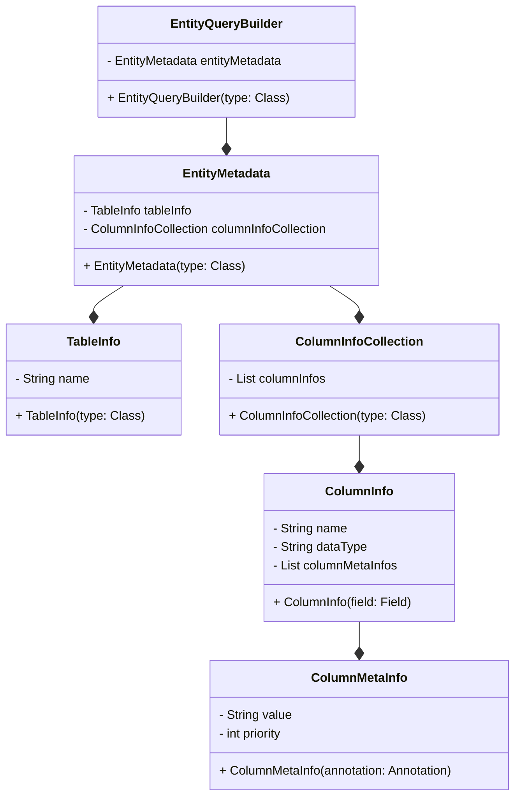

# jpa-query-builder

## Class Diagram

```mermaid
classDiagram
    class EntityQueryBuilder {
        - EntityMetadata entityMetadata
        + EntityQueryBuilder(type: Class<?>)
    }
    class EntityMetadata {
        - TableInfo tableInfo
        - ColumnInfoCollection columnInfoCollection
        + EntityMetadata(type: Class<?>)
    }
    class TableInfo {
        - String name
        + TableInfo(type: Class<?>)
    }
    class ColumnInfoCollection {
        - List<ColumnInfo> columnInfos
        + ColumnInfoCollection(type: Class<?>)
    }
    class ColumnInfo {
        - String name
        - String dataType
        - List<ColumnMetaInfo> columnMetaInfos
        + ColumnInfo(field: Field)
    }
    class ColumnMetaInfo {
        - String value
        - int priority
        + ColumnMetaInfo(annotation: Annotation)
    }

    EntityQueryBuilder --* EntityMetadata
    EntityMetadata --* TableInfo
    EntityMetadata --* ColumnInfoCollection
    ColumnInfoCollection --* ColumnInfo
    ColumnInfo --* ColumnMetaInfo
```
