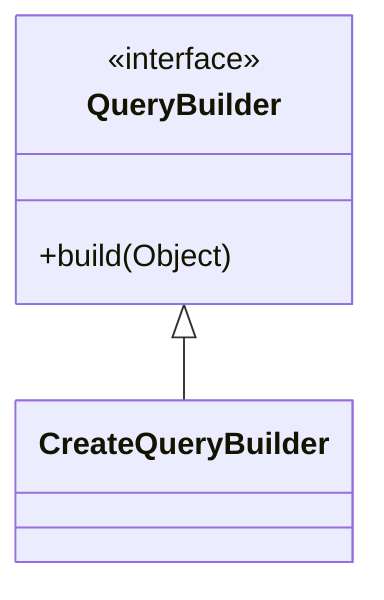

## QueryBuilder DDL Design
### Goal
- @Entity 어노테이션이 달려있는 객체를 쿼리 스트링으로 바꿔주는 클래스를 구현한다.

### Specification
- 클래스명 : CreateQueryBuilder
- input: Person 객체
- output: query String
- CRUD에 따라 만들 수 있는 쿼리는 달라질 수 있으므로 QueryBuilder인터페이스의 구현체로 만들도록 한다.

### UML
