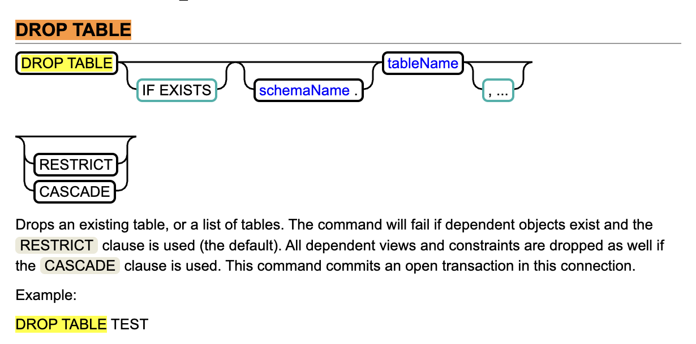

# Step 2

## TOTO
1. 엔티티 정보를 핸들링하기 위한 테이블, 필드 처리 클래스 생성
2. DROP 쿼리 빌더 구현
3. CREATE 쿼리 빌더 구현

---

## 공통고민
- Dialect를 지원해야하는가?
  - 이미 CREATE DDL에서 자바 타입에 대한 SQL 타입을 매핑해줘야하는 문제가 있다.
  - 지원하는 구조로 가고, H2 구현체만 남기고 진행한다.
  - 나중에 Dialect 바꿔서 동일코드가 MySQL에서 돌아가는걸 보여줘도 좋을것같다.

## 요구사항 1 - CREATE 쿼리 만들기
스펙: https://www.h2database.com/html/commands.html#create_table

DDL CREATE 문을 만든다.  
CREATE 문은 문법이 복잡하여 최소한으로만 구현한다.

### 기타 세부사항

1. @Transit 주의

영속화되지 않을 필드를 지정하는 애너테이션이다.

<details>
<summary>@Transit 개인적인 생각</summary>

사실 실무에서 제일 보기싫은 애너테이션 중에 하나이다.  
```개발자에게 엔티티의 모든 필드가 테이블 컬럼에 대응 하지 않을 수도 있다.``` 라는 불안감을 준다.

요구사항 스펙상 허용해야하지만,  
만약 내가 스펙을 정한다면 @Transit 애너테이션이 없거나, 자카르타 표준이니.. 냅두고   
사용하면 에러를 발생시키도록 할 것이다.


</details>


2. @GeneratedValue  
ID 생성 전략은 여러가지이다.
- DB 종속적인 Auto Increment
- JPA의 채번 테이블 생성
- 커스텀 채번 로직 

등이 있는데. Jakarta persistence에서 이런 스펙을 표준으로 제공하니
최소한 전략으로 빼고 미지원으로 예외를 던지도록 해야한다.

#### 3. @Table, @Column  
얘들이 명시되어있으면, 클래스명, 필드명이 아니라 애너테이션 이름으로 만들도록 한다.

---- 

## 요구사항 2 - DROP 쿼리 만들기
https://www.h2database.com/html/commands.html#drop_table


DDL DROP 문을 만든다. 테이블 명을 가져와서 DROP 문에 추가해주자.

### 유의할 점
 
1. 테이블이 존재하는 경우에만 DROP문 실행   
```TABLE IF EXISTS table_name;```  


2. DROP TABLE 시 외래키 연관관계가 있으면 연관데이터 삭제 대응  
```DROP TABLE IF EXISTS table_name CASCADE;```  
```DROP TABLE IF EXISTS table_name RESTRICT;```


### 고민 
이거 dialect 기반으로 지원해야하나?
jOOQ 나 JPA처럼 방언기반으로 동작해야 할 것으로 보인다.

트라이 해보고, MySQL 정도만 구현체를 붙여보자


