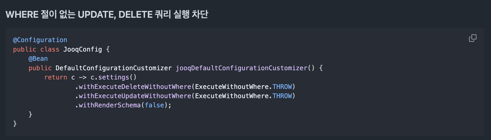

# Step 3

## 요구사항

- 요구사항 1 - insert 구현해보기
- 요구사항 2 - 모두 조회(findAll) 기능 구현해보기
- 요구사항 3 - 단건 조회(findById) 기능 구현해보기
- 요구사항 4 - delete 쿼리 만들어보기

## 요구사항 분석

- 요구사항 1
    - bulk insert는 반드시 되면 좋겠다.

- 요구사항 2,3
    - jOOQ 유료기능 중에 테이블을 Select 하면 특정 컬럼에 대한 조건절을 강제로 붙일 수 있는 설정이 있다. [jOOQ의 Policies](https://www.jooq.org/doc/latest/manual/sql-building/queryparts/policies/)
      이걸 비슷하게 구현 할 수 있지 않을까 고민이 된다. (일단 Optional로 남겨보자)

    - 이전 단계에서 만든 Step 인터페이스를 통하면 조건절 제어는 크게 어려워보이지 않는다. <br>
      이 방식은 QueryDSL과 jOOQ 모두 내부적으로 비슷하게 채택하고 있는 방식이며, jOOQ가 좀 더 촘촘하다.
      QueryDSL은 내부적으로 이 방식을 하나의 인터페이스로 처리하다보니 아래처럼 중복되는 불필요한 step을 사용자가 쓸 수 있음.

  ``` java
  from()
  .from()
  .from()
  ```

- 요구사항 4
    - jOOQ의 경우 delete 절에 where 절이 없으면 실행을 차단하는 설정이 있다. 이것도 추가해보자.
    - 

## TODO

- [x] 1.0 - TableField에 엔티티 필드의 데이터 저장되도록 구현
- [ ] 1.1 - insert 구현 
- [ ] 1.2 - bulk insert 구현 (optional)


- [ ] 2.1 - 모두 조회(findAll) 기능 구현


- [ ] 3.1 - 단건 조회(findById) 기능 구현
- [ ] 3.2 - Policies 구현 (optional)


- [ ] 4.1 - delete 쿼리 만들어보기
- [ ] 4.2 - delete 차단 설정 추가 (optional)


## UMl


## 느낀점
설계하고 만들다보니...   
jOOQ + JPA 그 어딘가의 중간쯤이 되어버린 것 같다.  
예전에 완전히 죽어버린 [requery](https://github.com/requery/requery)라는 녀석이 생각난다.  

